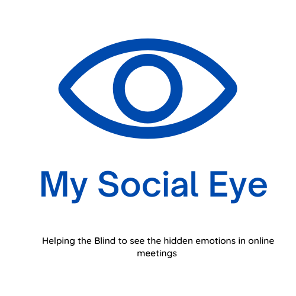

# My Social Eye:



A Software Program to help the blind and VI to determine others’ emotional and mood changes, etc all in real-time.

More Description of the project could be found here at this youtube video:
[My Social Eye!](https://youtu.be/uam2H85lXko)

## To run theapp:
Pre-requesities (Install Requirements):

Have Python installed (preferred python > 2.7)
Then install requirements:
```
   python -m pip install --upgrade pip
   pip install numpy
   pip install tensorflow
   pip install -U scikit-image
   python -m pip install -r requirements.txt
```
1. From Terminal:

    ```python
    python gpguii.py
    ```
2. Or using the `.exe` file

    To build this `.exe` you can use this command in the same folder as `gpguii.py`:

    ```python
    pyinstaller --collect-submodules "sklearn" --icon=test.ico -F -i --clean gpguii.spec --onefile -w gpguii.py
    ```
